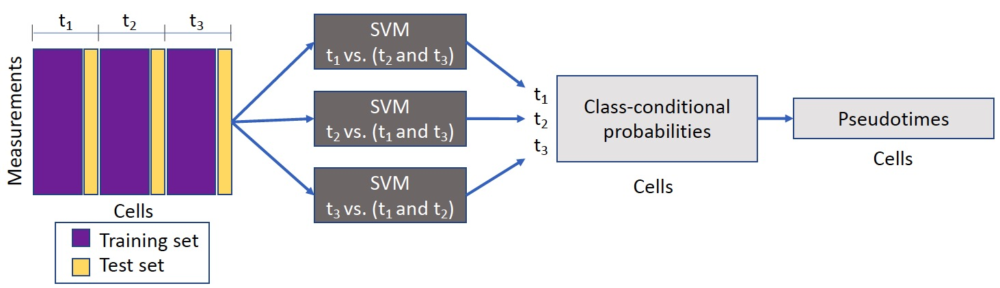

# Sceptic

[**Installation**](#installation)
| [**Enviroment**](#enviroment)
| [**Example**](#example)
| [**Input**](#input)
| [**Output**](#output)
| [**Parameter**](#parameter)
| [**Citation**](#citation)
| [**Contact**](#contact)

Sceptic can perform pseudotime analysis on various types of single-cell/single-nucleus data. The model takes as input a collection of single-cell/single-nucleus data and then learns the relationship between the observed data and the associated time stamps, and finally uses the trained model to assign to each cell a real-valued pseudotime. Ideally, the pseudotimes assigned by Sceptic reflect each cell's progression along a notion of time---developmental, cell cycle, disease progression, aging---that is appropriate to the given data. Ideally, the pseudotimes assigned by Sceptic reflect each cell's progression along a notion of time---developmental, cell cycle, disease progression, aging---that is appropriate to the given data.




## Installation<a id="installation"></a>
Sceptic software is available on the Python package index (PyPI), latest version 0.0.2. To install it using pip, simply type:
```bash
$ pip install -i https://test.pypi.org/simple/ sceptic
```

## Enviroment<a id="enviroment"></a>
Sceptic is associated with the following packages.
- python >= 3.7.7
- numpy >= 1.19.5   
- pandas >= 1.3.5
- sklearn >= 1.0.2 

## Examples (python script) <a id="examples"></a>
Please download the data from [scGEM](https://github.com/)

```bash
$ python test/scGEM/scGEM.py 
```
The script will generate 4 outputs from Sceptic described in the section above and save it at: test/scGEM/.

## Parameters of ```class Sceptic``` <a id="parameter"></a>

The list of parameters is given below:
> + ```kernel```: The kernel function for sceptic SVM classfier (default=('linear', 'rbf')). Sklearn supports four kinds of [kernels](https://scikit-learn.org/stable/modules/svm.html#kernel-functions): linear, polynomial, rbf, sigmoid.  
> + ```C```: The C parameter for rbf kernel (default=[0.1, 1, 10]). The C parameter trades off correct classification of training examples against maximization of the decision function’s margin. See more details [here](https://scikit-learn.org/stable/auto_examples/svm/plot_rbf_parameters.html#sphx-glr-auto-examples-svm-plot-rbf-parameters-py).
> + ```eFold```: # of folds for external cross-validation (default=5).
> + ```iFold```: # of folds for internal cross-validation (default=4).

## Input<a id="input"></a>

In case the user is providing the input data:
- `data_concat`: the input cell by measurement matrix. (# of cells by # of measurements)
- `label`: processed cell time label. (# of cells by 1)
- `label_list`: unique list of possible cell time labels. (# of time points by 1)
- `parameters`: Sceptic parameter dictionary. (default={'kernel': ('linear', 'rbf'), 'C': [0.1, 1, 10]}
)

## Output<a id="output"></a>

When one uses sceptic.run_sceptic_and_evaluate function, several outputs are generated:
- `cm`: the confusion matrix for Sceptic's nested cross-validation. (# of time_points by # of time points)
- `label_predicted`: Sceptic's predicted discrete label for each cell. (# of cells by 1)
- `pseudotime`: Sceptic's predicted pseudotime (continuous) for each cell. (# of cells by 1)
- `sceptic_prob`: the class-proabilities for each cell. (# of cells by # of time points)


## Contact<a id="contact"></a>
In case you have questions, reach out to `gangliuw@uw.edu`.


## Citation<a id="citation"></a>
[Pseudotime analysis for time-series single-cell sequencing and imaging data (to be updated)](https://ganglitarheel.github.io/publications/)

If you have found our work useful, please consider citing us(to be updated):

```
@article{li2023sceptic,
  title={Pseudotime analysis for time-series single-cell sequencing and imaging data},
  author={Gang Li, Hyeon-Jin Kim, Sriram Pendyala, Ran Zhang, Christine M. Disteche, Jean-Philippe Vert, Xinxian Deng, Doug Fowler, and William Stafford Noble},
  journal={bioRxiv},
  year={2023},
  publisher={Cold Spring Harbor Laboratory}
}
```
